# 杭州仁爱医院病历管理系统

### 1.项目设计

#### （1）项目总体构成

本项目为杭州市仁爱医院病历管理系统，具有注册登陆，添加医生、患者信息、编辑删除信息以及查询信息等功能

本系统采用NodeJS+MongoDB+Express等技术，使用Bootstrap、Vue前端框架，其中包含：Vue-resource以及

Vue-Router。

Vue-resource:是一个通过XMLHttpRequrest或JSONP技术实现异步加载服务端数据的Vue插件

提供了一般的 HTTP请求接口和RESTful架构请求接口，并且提供了全局方法和VUe组件实例方法。

Vue-Router：是Vue.js官方的路由管理器

#### （2）引入的包在项目中的作用相关说明

1)express:使用express包搭建服务,具备中间件的使用、路由、模板引擎、静态文件服务、设置代理等主要能力

2）mongoose：是Node.js操作MongoDB数据库需要依赖的Node.js第三方包，使用mongoose提供的connect方法即可连接数据库。mongoose包含三个概念：Schema，用来定义数据库的结构，schema不具备操作数据库的能力。Model，由schema编译出的构造器，用来定义集合模型，Model的实例即是文档。model具备数据库的增删改查。Entity，由model构造器创建的实体，即文档document。

3）art-template： 是一个高速的JavaScript模板渲染引擎，它采用作用域预声明的技术来优化模板渲染速度，将html字符串渲染成需要的结果。

4）body-parser：它用于解析客户端请求的body中的内容,内部使用JSON编码处理,url编码处理以及对于文件的上传处理。

5）express-session：session 运行在服务器端，当客户端第一次访问服务器时，可以将客户的登录信息保存。
当客户访问其他页面时，可以判断客户的登录状态，做出提示，相当于登录拦截。

#### （3）项目目录结构和各个部分的说明。

1、public目录： 项目公共目录，存放静态资源(img、js、css)和公共资源，404错误提示页面；

2、routor目录： 路由控制器目录，存放路由文件，将所有的业务逻辑都都写在这里；

3、views目录：  视图/模版目录，存放HTML模板文件；

4、module目录： 自己写的一些模块；

5、node_modules：存放所有的项目依赖库，配置package.json之后执行npm install后自动创建的文件夹；

6、app.js： 项目入口文件，程序初始运行文件；

7、package.json ：项目配置信息，依赖模块的定义

### 2.使用说明书

本系统为杭州市仁爱医院病历管理系统，系统功能有：注册（注册为管理员）、登陆、添加医生信息、添加病人信息、查询医生或病人信息、编辑或删除病历、登出等功能

#### （1）注册：输入帐号、密码，注册为管理员

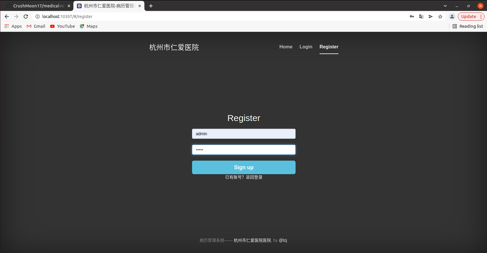

#### （2）管理员登陆：管理员输入帐号密码，点击登陆

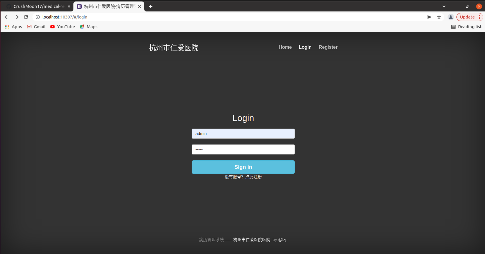

#### 管理员进入系统：可以查看医生信息、病人信息、医患比例及患者性别比例，可以添加医生、添加病人

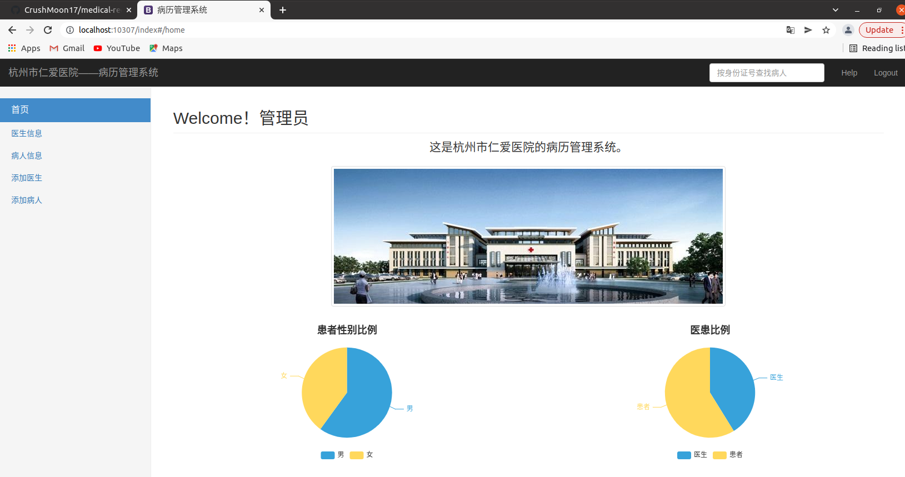

#### （3）管理员添加医生：管理员将本院医生信息添加到系统，本院医生即可用自己的工号及密码登陆系统

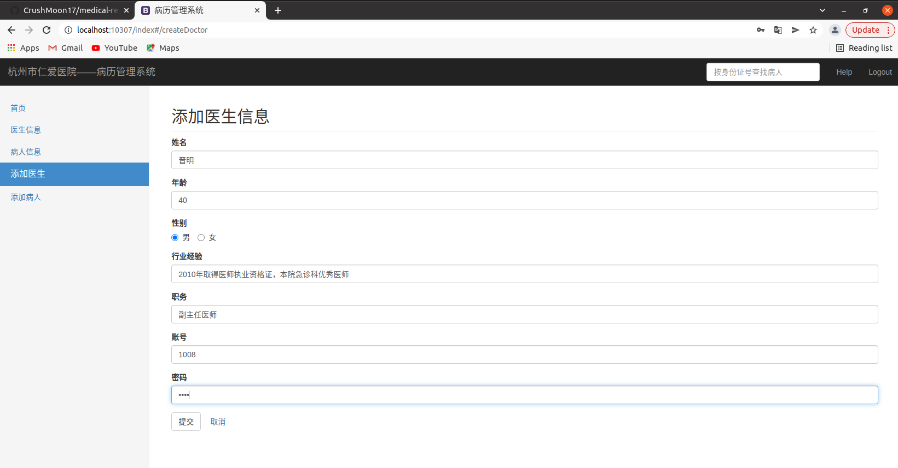

#### 医生信息表

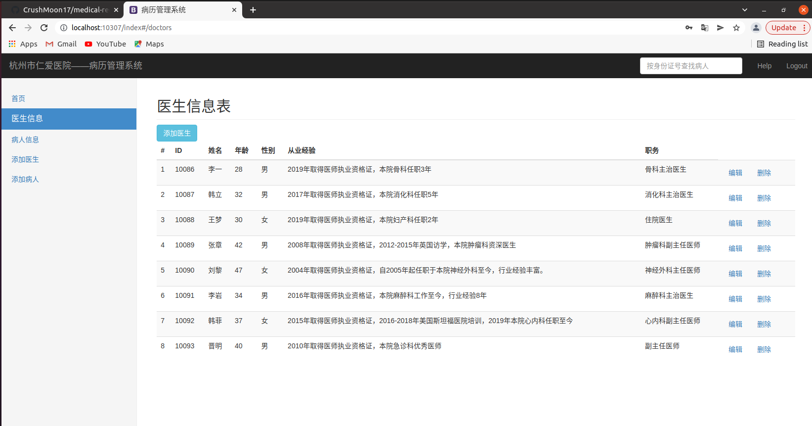

#### （4）医生登陆：

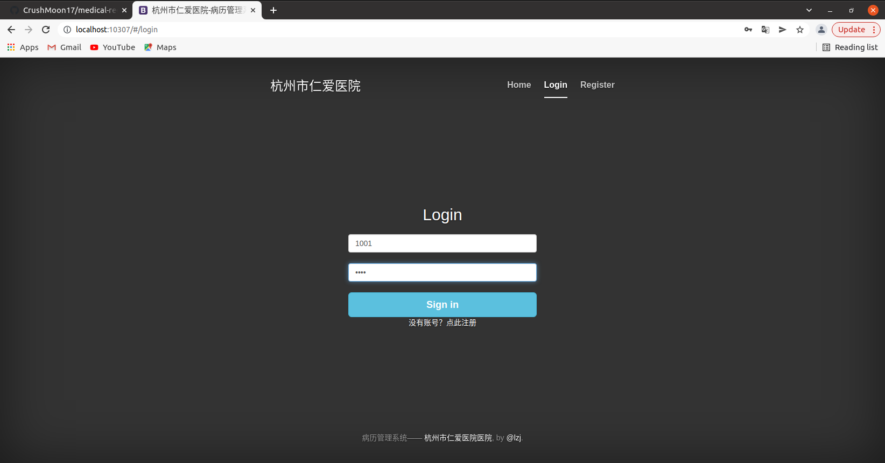

#### 医生进入系统：可查看病人信息、患者性别比例以及各科病人比例，添加病历

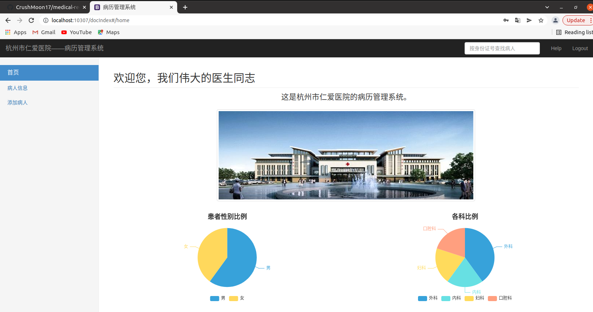

#### （5）添加病历：管理员和医生都可添加病历

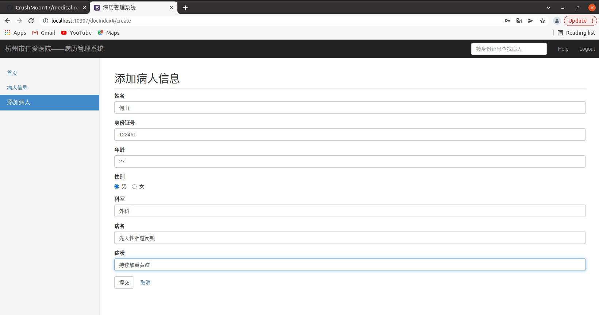

#### 添加后病人信息

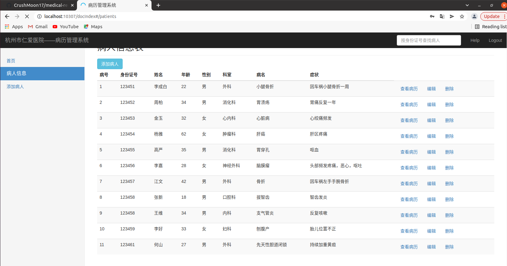

#### （6）信息编辑：可以修改或删除患者信息

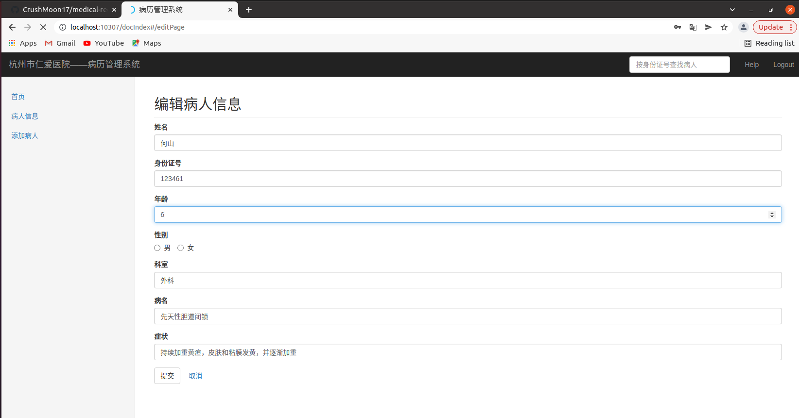

#### 更改后的信息

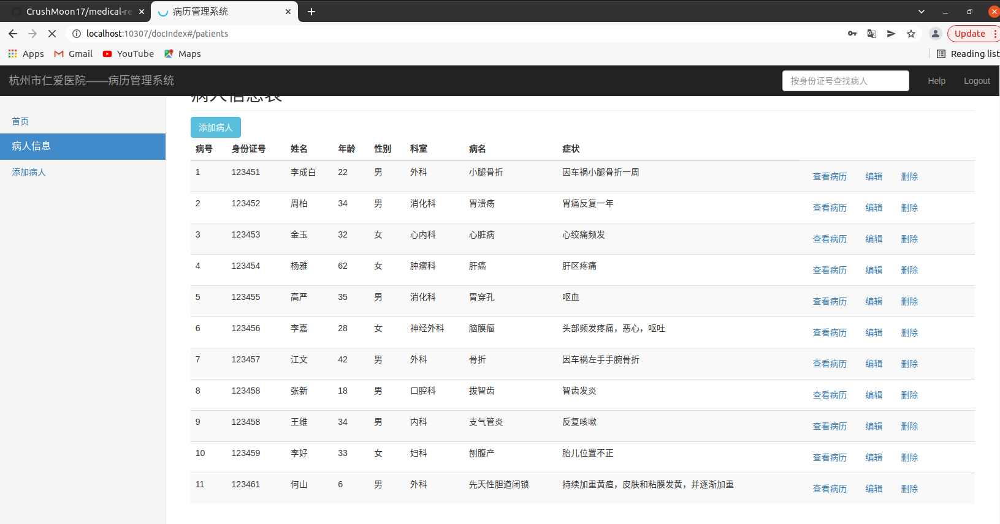

#### 删除信息

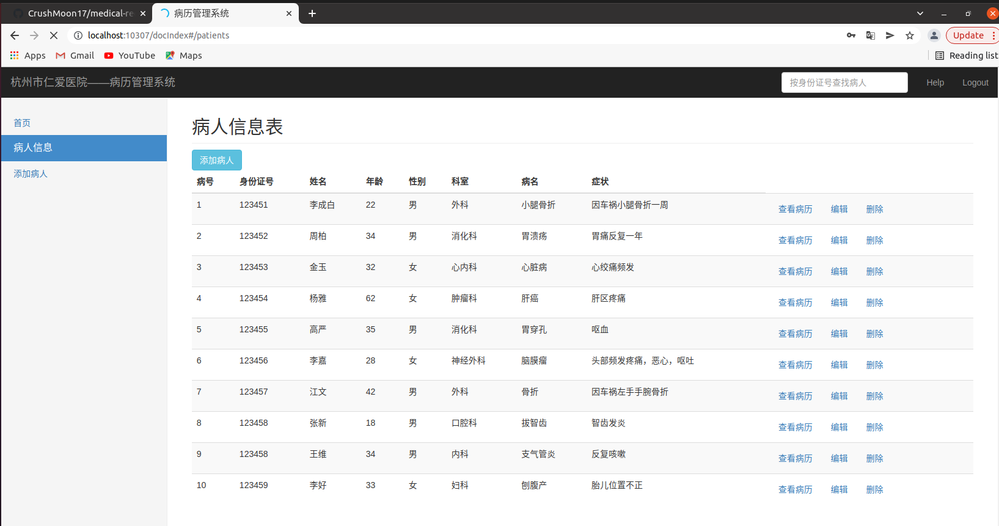

#### 点击查看病历可以编辑患者过往病史

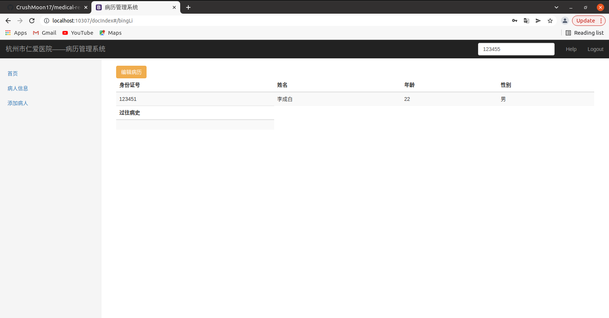

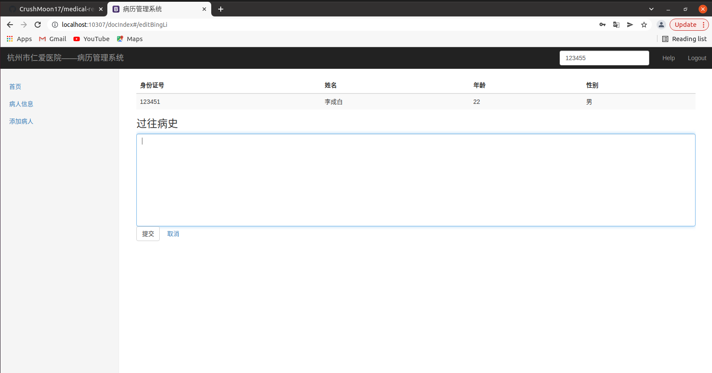

#### （7）患者信息查询：输入患者身份证号即可查询

### 3.开发日记

#### 软件架构

软件架构说明

#### 安装教程

1.  xxxx
2.  xxxx
3.  xxxx

#### 使用说明

1.  xxxx
2.  xxxx
3.  xxxx

#### 

